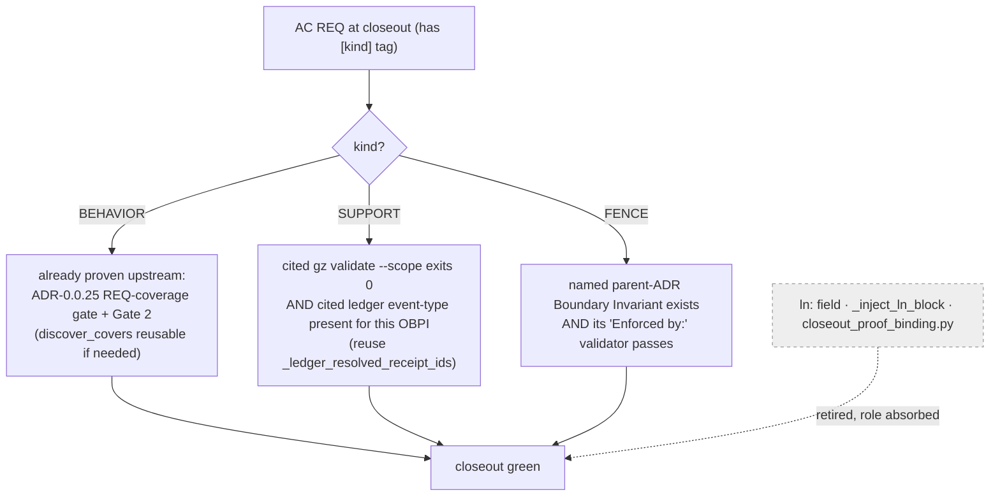
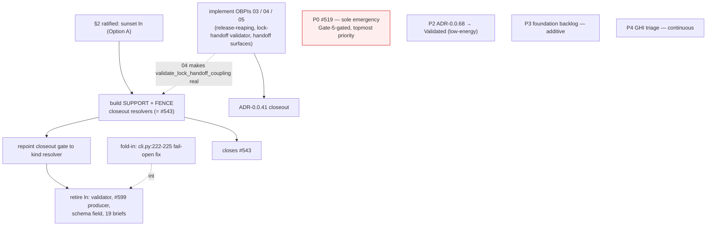

# Restore-Health Convergence Roadmap

> **SUPERSEDED 2026-06-10** by
> [`docs/governance/build-to-1.0-campaign-2026-06-10.md`](../governance/build-to-1.0-campaign-2026-06-10.md)
> (operator ruling: the campaign subsumes all prior plans). The `ln`-sunset
> sequencing it describes is now campaign Phase A. Retained for audit.

> **Layer-3 planning view — not canon.** This is a derived planning document, not
> a governance artifact. The canonical decision record for the ratified `ln`
> sunset (§2) is the foundation ADR authored under §3; this roadmap only
> sequences the work. Lives under `docs/design/**`, which `mkdocs.yml` excludes
> from the site build (`exclude_docs:` L210–211), so it cannot trip
> `mkdocs build --strict`.

**Authored:** 2026-06-09 · **HEAD:** `81df3a51` on `main`, synced 0/0 ·
**Source brief:** `ultraplan-brief.md` · **Rev:** 2 (resolver-centric reframe)

---

## 0. Provenance and corrections

This roadmap reconciles two ultraplan **cloud drafts**, both composed in a
Bash-blocked container (Python 3.13.13 absent from the pre-tool hook) that could
**not verify its own claims**. Every assertion below was re-verified in a working
local session (Windows / `uv run gz`, source reads). The corrections:

| # | Cloud claim | Live state | Resolution |
|---|---|---|---|
| C1 | ADR-0.0.41 is "the `ln`-coupled closeout"; sunsetting `ln` "unblocks 0.0.41" | 0.0.41 is `token-block-lock-discipline`; grep of its package for `ln`/`closeout_proof_binding` = **0 hits** | **Decoupled.** `ln` and 0.0.41 are independent (see §4). |
| C2 | 0.0.41 "can attest as-is like 0.0.67" | 0.0.41 is 2/5; OBPIs 03/04/05 are `pending`/`draft`, "ledger proof of completion is missing" | **0.0.41 needs real implementation,** not a ceremony shortcut. |
| C3 | §3 ruling was "ratified"; "~17 briefs" carry `ln:` | Source brief flagged §3 **open**; **22** briefs carried `^ln:` (grep ground truth, per brief's own discovery-checklist warning) | §3 ratified **here** by operator (§2); count = 22. **LANDED 2026-06-10:** OBPI-0.0.69-04 stripped all 22 briefs and deleted the `ln:` surface. |
| **C4** | Under a FENCE resolver, 0.0.41 "unblocks for free" / "attests as-is" because its blocking REQ resolves via `gz validate --lock-handoff-coupling` | (a) blocker is the **OBPI-completion gate** (03/04/05 have no completion events); (b) `validate_lock_handoff_coupling` is a **no-op stub** (`del project_root; return []`); (c) 0.0.41 is `pre_closeout` | **C2 recurring.** Rejected on three grounds (§3.4). An honest resolver makes 0.0.41 *harder* to close, not free. |
| **Adopted** | `--req-kind-discipline` is a citation-shape **linter**, not a proof resolver; the real build is the SUPPORT + FENCE closeout **resolvers** (= #543), with deletion downstream | Verified line-by-line in `validate_req_kind.py` (§3.1) | **Adopted as the shape of Option A** (§3). |

---

## 1. Verified status

Re-checked locally 2026-06-09:

| Signal | Verified state |
|---|---|
| `main` | HEAD `81df3a51`; synced 0/0 to `origin/main` |
| Root-cause gate | ✅ **Landed** — ADR-0.0.68 `green-between-sessions-gate` Completed + attested (2/2) |
| Open emergencies | **#519 only** — codex context surface exhausts the 258K window |
| Open GHIs | **38** (steady-state triage scale) |
| Foundation ADR set | **68** packages; ADR-0.0.68 Completed (one step short of Validated) |
| ADR-0.0.67 | Validated (3/3) — closeout exemplar |
| ADR-0.0.41 | **Pending / pre_closeout / BLOCKED, 2/5** — blocked by 3 unimplemented OBPIs (Track B); a paused step-6 ceremony exists (`completed_at: null`, 2026-06-07) |

The structural red-generator is gone: ADR-0.0.68 now mechanically enforces
green-between-sessions (pre-push `gz check` hook + session-green-gate validator).
Remaining work is additive / maintenance.

---

## 2. Ratified decision — sunset `ln` (Option A)

**Operator ruling (2026-06-09): Option A — sunset the `ln` (closeout-proof-binding)
surface.** Cost acknowledged: Option A **retires the #599 work that landed today**.

But Option A is **not** "delete `ln` + tidy briefs." That framing buried the only
part that is real design. What `ln` provides today is the **only ledger-existence
proof floor at closeout** (`closeout_proof_binding.py`), and it applies that floor
**kind-blind** — every Acceptance-Criteria REQ must carry an `ln:` receipt,
including SUPPORT and STRUCTURAL-FENCE REQs whose kind-appropriate proof is a
*validator run* or a *parent-ADR invariant*, not a per-REQ receipt.

**That mismatch is what "`ln` masks #543" means.** A FENCE REQ has no natural
receipt → closeout went red → #599's "auto-populate `ln:` from resolved receipts"
makes it green by stuffing in *whatever receipts happened to resolve*, regardless
of whether the REQ's kind-appropriate channel actually holds. The auto-populate
**is** the masking; it is the red-generator the brief wants subtracted.

So **Option A = promote the proof floor out of the kind-blind `ln` field into the
three kind-appropriate channels** — building out the two (SUPPORT, FENCE) left as
prose-citation stubs. *That* is #543. Deletion is downstream cleanup that only
becomes safe once the resolver carries the floor.

---

## 3. The resolver design (the contract-bearing core of the ln-sunset ADR)

Heavy / foundation ADR (CLI validator + schema field + ceremony gate + 19
briefs). All five gates + universal Gate-5 attestation. Author via `gz-design` →
`gz-adr-create`.

### 3.1 Why `--req-kind-discipline` is not the proof channel (verified)

`src/gzkit/commands/validate_req_kind.py` checks **citation shape, not proof
resolution** — it is an authoring-discipline linter:

| Kind | What it checks **today** | What it does **not** check |
|---|---|---|
| BEHAVIOR (`_check_behavior_req`, L58–67) | `"tests/"` appears in `## Allowed Paths` | that a covering test exists or passes |
| SUPPORT (`_check_support_req`, L70–92) | REQ *line text* contains `gz validate --` **and** a ledger keyword | that the validator passes or the event exists |
| STRUCTURAL-FENCE (`_check_structural_fence_req`, L95–117) | parent ADR *has a* `## Boundary Invariants` heading | that *this* REQ maps to a *specific* invariant, or that its `Enforced by:` validator passes |

The only validator with a real closeout floor is `closeout_proof_binding.py` —
kind-blind, ledger-existence (`_ledger_resolved_receipt_ids`, L149), scoped to
ADRs with an in-progress closeout ceremony (`completed_at` unset, L85–102).

### 3.2 The replacement: a per-kind closeout resolver

A concrete closeout-time resolver that dispatches each AC REQ on its declared
`[kind]`:



- **BEHAVIOR was never the problem.** Test-exists-and-passes already lives in the
  `gz obpi complete` REQ-coverage gate (ADR-0.0.25 — *obpi-completion-req-coverage-gate*)
  + Gate 2. `ln` was pure redundancy here. AGENTS.md is explicit: "every REQ must
  have a covering passing test before `gz obpi complete`."
- **The actual build is the SUPPORT and FENCE resolvers** — the two channels
  `req_kind.py` itself flags deferred (`"advisory-support … ledger query deferred"`,
  FENCE `"grandfathered … audited at ADR closeout, not per-OBPI"`). Closing those
  two stubs **is #543**.

### 3.3 Correct ordering (the earlier deletion-first plan had the dependency backwards)

1. **Build the SUPPORT + FENCE closeout resolvers** (the #543 work; reuse
   `discover_covers` and `_ledger_resolved_receipt_ids`). Contract-bearing core.
2. **Repoint the closeout gate** from `--closeout-proof-binding` to the kind resolver.
3. **Then retire `ln`** — validator, `validate_cmd.py` wiring (8 sites), the #599
   producer in `obpi_complete.py`, the schema field, the 19 briefs — and fold in
   the `cli.py:222–225` fail-open fix (surfaced `ValidationError` + covering test).

### 3.4 Why 0.0.41 does **not** "unblock for free" (correction C4)

The second cloud draft claimed the FENCE resolver makes 0.0.41 attest as-is.
**Rejected on three independent grounds:**

1. **OBPI-completion gate is upstream.** 0.0.41 is BLOCKED because OBPIs 03/04/05
   have no ledger completion events (`done: no`). The resolver operates *per REQ
   at closeout*; you cannot reach it for OBPIs that were never run through
   `gz obpi complete`. No proof-channel redesign creates those events.
2. **The FENCE validator is a no-op stub.** `validate_lock_handoff_coupling`
   (`src/gzkit/governance/trust_audits/lock_handoff_coupling.py:19`) is literally
   `del project_root; return []` — "stub … full implementation lands in
   OBPI-0.0.41-04." A FENCE resolver pointed at it yields a **false green** unless
   OBPI-04 (one of the three unimplemented OBPIs) is built first.
3. **The dependency runs the other way.** An honest FENCE resolver makes 0.0.41
   *harder* to close — it must implement the real validator — not free. That
   false-green is precisely the vibing the resolver exists to make inert; the
   cloud's "unblocks for free" is itself the failure mode.

**Net:** the resolver improves the *quality* of 0.0.41's eventual closeout (FENCE
REQs resolve via a real invariant check instead of phantom receipts), but the
*binding blocker* is 0.0.41's own unimplemented OBPIs. The tracks stay decoupled.

### Anchors verified this session

| Surface | Action | Verified anchor |
|---|---|---|
| req-kind linter | Keep (authoring discipline) | `validate_req_kind.py` — 3 branches all citation-shape (§3.1) |
| Proof floor today | Retire after repoint | `closeout_proof_binding.py` — kind-blind ledger floor; `_ledger_resolved_receipt_ids` (L149) reusable for SUPPORT |
| BEHAVIOR proof | Reuse / defer to | `req_coverage.discover_covers(req_id, tests_root, *, features_root=None)` (L98); ADR-0.0.25 gate already enforces |
| FENCE validator | Must be real before resolver greens 0.0.41 | `lock_handoff_coupling.py:19` — **no-op stub** |
| #599 producer | Remove (step 3) | `obpi_complete.py` — `_inject_ln_block` (L1500, called L1143), `_render_ln_block` (L1465), `_strip_existing_ln` (L1479) |
| CLI wiring | Remove (step 3) | `validate_cmd.py` (8 sites); `parser_maintenance.py` `--closeout-proof-binding` (L601, wired L795) |
| Briefs | Strip `ln:` (step 3) | **19** carry `^ln:` |
| Fail-open seam | Fold-in fix | `trust_audits/cli.py:222–225` bare `except Exception: return []` |

### Confirm at authoring time

- Validator registration in `trust_audits/__init__.py`; the `ln:` schema field
  (`rg -l "\bln\b" src/gzkit/schemas/ src/gzkit/governance/brief_structure.py`).
- Coupled tests to retire/repoint — `tests/test_obpi_complete_ln_producer.py`
  (**exists**, #599); cloud-named `test_closeout_proof_binding.py`,
  `test_ceremony_ln_consumption.py`, `test_closeout_ceremony_consumption.py`
  (existence unconfirmed).
- Exact `validate_cmd.py` line positions (count verified = 8).

---

## 4. Sequenced work-list

### P0 — #519 (sole emergency · topmost priority · operator-gated)

Codex gzkit context surface exhausts the 258K window. Interim byte relief landed
(root AGENTS.md under Codex's 32,768 B cap). Durable cure: <15k registry-projected
surface (#533) + ADR-0.0.37 build-out + Gate-5 attestation. **Cannot close in a
fully autonomous run.**

### P1-A — `ln`-sunset foundation ADR (highest *leverage*)

Author per §3 (resolver-first ordering). Completes the SUPPORT + FENCE channels →
**closes #543**, subtracts the auto-populate red-generator. Standalone — affects
*future* closeouts, **not** 0.0.41.

### P1-B — ADR-0.0.41 closeout (independent of `ln`)

Implement OBPIs **03** (`release-fail-closed-and-reaping`), **04**
(`lock-handoff-coupling-validator`), **05** (`session-handoff-surface-updates`)
via `gz-obpi-pipeline`, then run closeout. Real implementation, not a ceremony
shortcut (C2/C4). Note the cross-track tie: **OBPI-04 implements the very
validator (`validate_lock_handoff_coupling`) that P1-A's FENCE resolver will
call** — so a truthful FENCE green for 0.0.41 depends on 0.0.41-04 being real,
not on the resolver. Resolve the paused step-6 ceremony (`completed_at: null`)
before re-entering closeout.

### P2 — ADR-0.0.68 → Validated (independent · low-energy)

Run its audit ceremony (COMPLETED → VALIDATED) per `.claude/rules/adr-audit.md`:
`gz adr audit-check` → `gz audit` → `gz adr emit-receipt … --event validated`.
Locks the green-between-sessions gate as a permanent validated floor.

### P3 — Foundation backlog (additive · felt-need-paced)

Of 68 foundation ADRs, a backlog remains short of Validated (~19 Draft + ~8
Proposed per brief — re-confirm at triage). Additive now that the red-generator
is gone. Do **not** restart the retired OBPI-17 density-classification route.

### P4 — GHI steady-state triage (continuous)

38 open GHIs — maintenance cadence. Run `ghi-triage`.

---

## 5. Dependency diagram (corrected)



**Key:** no arrow from the `ln`-sunset chain to 0.0.41 — they are decoupled. The
only cross-track edge runs *from* 0.0.41-04 *to* the resolver (a real
`validate_lock_handoff_coupling` is needed for a truthful FENCE green), the
opposite of the cloud's "ln unblocks 0.0.41." P0 is highest *priority*
(Gate-5-gated); the `ln`-sunset ADR is highest *leverage* (closes #543).

---

## 6. Verification anchors (re-run locally)

```bash
uv run gz adr report ADR-0.0.68          # Completed, attested, 2/2
uv run gz adr report ADR-0.0.41          # Pending, pre_closeout, BLOCKED, 2/5 (03/04/05 unimplemented)
uv run gz adr report ADR-0.0.67          # Validated, 3/3 (closeout exemplar)
git log -1 --oneline                     # 81df3a51
git status -sb                           # clean, synced 0/0
gh issue list --state open --label emergency   # only #519
grep -rl "^ln:" docs/design/adr | wc -l        # 19 briefs carry ln:
# Resolver-design source anchors:
#   src/gzkit/commands/validate_req_kind.py            (citation-shape linter)
#   src/gzkit/governance/trust_audits/closeout_proof_binding.py   (kind-blind ledger floor)
#   src/gzkit/governance/trust_audits/lock_handoff_coupling.py    (no-op stub — OBPI-0.0.41-04)
#   src/gzkit/governance/req_coverage.py:98            (discover_covers — reusable)
```
