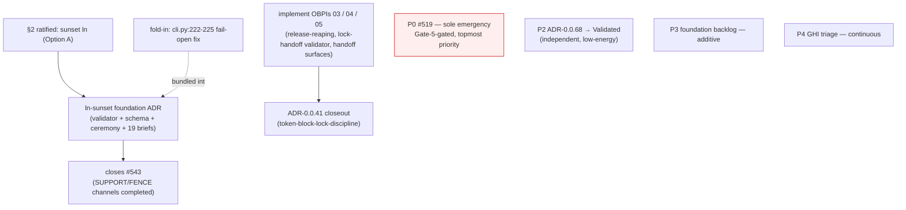

# Restore-Health Convergence Roadmap

> **Layer-3 planning view — not canon.** This is a derived planning document, not
> a governance artifact. The canonical decision record for the ratified `ln`
> sunset (§2) is the foundation ADR authored under §3; this roadmap only
> sequences the work. Lives under `docs/design/**`, which `mkdocs.yml` excludes
> from the site build (`exclude_docs:` L210–211), so it cannot trip
> `mkdocs build --strict`.

**Authored:** 2026-06-09 · **HEAD:** `3c1695eb` on `main`, synced 0/0 ·
**Source brief:** `ultraplan-brief.md`

---

## 0. Provenance and corrections

This roadmap supersedes the ultraplan **cloud draft**, which was composed in a
Bash-blocked container (Python 3.13.13 absent from the pre-tool hook) and could
**not verify its own claims**. Every state assertion below was re-verified in a
working local session (Windows / `uv run gz`). Three material corrections to the
cloud draft were found and are baked in here:

| # | Cloud draft claimed | Live state | Correction |
|---|---|---|---|
| C1 | ADR-0.0.41 is "the `ln`-coupled closeout"; the `ln` decision / sunset-ADR "unblocks 0.0.41" | ADR-0.0.41 is `token-block-lock-discipline`; a grep of its **entire** package for `ln`/`closeout_proof_binding` returns **0 hits** | **`ln` and 0.0.41 are independent.** Sunsetting `ln` does **not** unblock 0.0.41. They are two separate tracks (see §4). |
| C2 | 0.0.41 "can attest as-is like 0.0.67 if receipts resolve via the ledger" | 0.0.41 is 2/5 OBPIs; OBPIs 03/04/05 are `pending`/`draft`, `done: no`, "ledger proof of completion is missing" | **0.0.41 needs real implementation,** not a ceremony shortcut. 0.0.67 attested as-is only because all 3 of its OBPIs were already `attested_completed`. |
| C3 | "~17 briefs" carry `ln:` frontmatter; §3 ruling was a "ratified" decision | 19 briefs carry `^ln:`; the source brief explicitly flags §3 as **open and operator-gated** | Count corrected to **19**. §3 ruling was **not** ratified in the cloud session — it is ratified here, by the operator, on 2026-06-09 (§2). |

---

## 1. Verified status

All signals re-checked locally on 2026-06-09:

| Signal | Verified state |
|---|---|
| `main` | HEAD `3c1695eb`; synced 0/0 to `origin/main`; only untracked file is `ultraplan-brief.md` |
| Root-cause gate | ✅ **Landed** — ADR-0.0.68 `green-between-sessions-gate` Completed + attested (2/2 OBPIs) |
| Open emergencies | **#519 only** — codex gzkit context surface exhausts the 258K window |
| Open GHIs | **38** (steady-state triage scale, not a restore-health queue) |
| Foundation ADR set | **68** packages on disk; ADR-0.0.68 Completed (one step short of Validated) |
| ADR-0.0.67 | Validated (3/3) — last fully-closed foundation ADR; closeout exemplar |
| ADR-0.0.41 | **Pending / pre_closeout / BLOCKED, 2/5** — blocked by 3 unimplemented OBPIs (see Track B) |

**"Done enough" inflection:** the structural red-generator is gone. For eight
prior sessions `main` went silently RED *between* sessions; ADR-0.0.68 now
mechanically enforces green-between-sessions (pre-push `gz check` hook +
session-green-gate validator). Remaining work is additive / maintenance.

---

## 2. Ratified decision — sunset `ln` (Option A)

**Operator ruling (2026-06-09): Option A — sunset the `ln` (closeout-proof-binding)
surface.**

The source brief flagged a live inconsistency: the handoff chain recorded an
operator intent to *sunset* `ln`, but the most recent commit — **#599,
`3c1695eb`** — does the opposite, auto-populating brief `ln:` from resolved
receipts (`_inject_ln_block` producer in `obpi_complete.py`). These are opposite
strategies for one surface. Per the "name confusion, don't resolve unilaterally"
rule, the ruling was reserved for the operator and is recorded here.

**Ruling rationale (Option A):** `gz validate --req-kind-discipline` is the real
proof channel; `ln` *masks* the deferred SUPPORT/STRUCTURAL-FENCE req-kind gap
(#543) rather than closing it. Sunset is **subtraction of the red-generator** and
**structurally closes #543**.

**Cost acknowledged:** Option A **retires the #599 work that landed today**
(`3c1695eb`). That is the conscious tradeoff — the just-landed auto-populate
producer is removed in favor of a derived view.

---

## 3. Sunset-`ln` scope (the foundation ADR to author)

This is a **heavy / foundation** ADR (CLI validator + schema field + ceremony
gate + 19 briefs). All five gates + universal Gate-5 human attestation apply.
Author via `gz-design` → `gz-adr-create`; decompose into OBPIs.

### Anchors verified this session

| Surface | Action | Verified anchor |
|---|---|---|
| Validator | Retire | `src/gzkit/governance/trust_audits/closeout_proof_binding.py` (10.9 KB) exists |
| CLI wiring (validate) | Remove | `src/gzkit/commands/validate_cmd.py` — **8** `closeout_proof_binding` wiring sites |
| CLI wiring (flag) | Remove | `src/gzkit/cli/parser_maintenance.py` — `--closeout-proof-binding` flag (L601–602), `dest=check_closeout_proof_binding`, wired L795 |
| #599 producer | Remove | `src/gzkit/commands/obpi_complete.py` — `_inject_ln_block` (L1500, called L1143), `_render_ln_block` (L1465), `_strip_existing_ln` (L1479) |
| Brief frontmatter | Strip `ln:` blocks | **19** briefs carry `^ln:` (after the surface retires) |
| Replacement view | Complete deferred channels | `src/gzkit/req_kind.py` — SUPPORT returns `"advisory-support"` (L218, "ledger query deferred"); STRUCTURAL-FENCE returns `"grandfathered"` (L220, "audited at closeout, not per-OBPI") |
| Fold-in: fail-open seam | Surface `ValidationError` | `src/gzkit/governance/trust_audits/cli.py:222–225` — bare `except Exception: return []` silently passes `audit_skill_alignment` if `_known_cli_verb_paths()` raises (violates `.claude/rules/pythonic.md` "no bare `except Exception`"). Replace with surfaced error + covering test (TDD RED→GREEN) |

### Confirm at authoring time (not yet verified)

- Registration of the validator in `trust_audits/__init__.py`.
- The `ln:` field definition in the schema — locate via
  `rg -l "\bln\b" src/gzkit/schemas/ src/gzkit/governance/brief_structure.py`.
- Coupled tests to retire — `tests/test_obpi_complete_ln_producer.py`
  (**exists**, added by #599), and the cloud draft's named
  `tests/governance/test_closeout_proof_binding.py`,
  `tests/governance/test_ceremony_ln_consumption.py`,
  `tests/test_closeout_ceremony_consumption.py` (existence unconfirmed).
- Exact line numbers in `validate_cmd.py` (count verified = 8; positions not captured).

### What the replacement view must do (closes #543)

Replace `ln`'s "green-at-closeout" role with a derived view over the req-kind
proof channels + ledger:

- **SUPPORT** → actually query the ledger (currently "ledger query deferred").
- **STRUCTURAL-FENCE** → actually audit the parent-ADR `## Boundary Invariants`
  anchor at closeout (currently "grandfathered").

This lets `gz validate --req-kind-discipline` carry green-at-closeout alone, and
**closes #543**.

---

## 4. Sequenced work-list

Two of the cloud draft's "P1" items are **independent tracks**, not one bundle
(correction C1).

### P0 — #519 (sole emergency · topmost priority · operator-gated)

- **What:** codex gzkit context surface exhausts the 258K window.
- **Status:** interim byte relief landed (root AGENTS.md under Codex's 32,768 B cap).
- **Durable cure:** <15k registry-projected surface (#533) + ADR-0.0.37 build-out
  + Gate-5 human attestation.
- **Gate:** requires the operator for Gate 5 — **cannot close in a fully
  autonomous run.** Highest *priority*; not autonomously closable.

### P1-A — `ln`-sunset foundation ADR (highest *leverage*)

- **Now ratified** (§2). Author per §3 scope → completes the deferred
  SUPPORT/FENCE channels → **closes #543**.
- Standalone convergence move: subtracts the red-generator. Affects **future**
  closeouts — **not** ADR-0.0.41.

### P1-B — ADR-0.0.41 closeout (independent of `ln`)

- ADR-0.0.41 `token-block-lock-discipline` is BLOCKED at 2/5 because OBPIs
  **03** (`release-fail-closed-and-reaping`), **04**
  (`lock-handoff-coupling-validator`), **05** (`session-handoff-surface-updates`)
  are unimplemented drafts ("ledger proof of completion is missing").
- **This is real implementation work** (correction C2), not an "attest-as-is"
  ceremony. Implement the three OBPIs via `gz-obpi-pipeline`, then run closeout.

### P2 — ADR-0.0.68 → Validated (independent · low-energy)

- ADR-0.0.68 is Completed + attested. Run its audit ceremony
  (COMPLETED → VALIDATED) per `.claude/rules/adr-audit.md`:
  `gz adr audit-check` → `gz audit` → `gz adr emit-receipt … --event validated`.
- Locks the green-between-sessions gate as a permanent validated floor — the
  symbolic treadmill exit.

### P3 — Foundation backlog (additive · felt-need-paced)

- Of 68 foundation ADRs, a backlog remains short of Validated (~19 Draft + ~8
  Proposed per brief §3 — **re-confirm exact split at triage time**). With the
  red-generator gone these are additive; pace by felt need, not momentum.
- Do **not** restart the retired OBPI-17 density-classification route.

### P4 — GHI steady-state triage (continuous)

- 38 open GHIs — maintenance cadence, not restore-health. Run `ghi-triage` for a
  rank-ordered pull list.

---

## 5. Dependency diagram (corrected)



**Key:** `ln`-sunset (P1-A) and ADR-0.0.41 (P1-B) are **decoupled** — no arrow
between them. P0 is highest *priority* but Gate-5-gated; the `ln`-sunset ADR is
highest *leverage* (closes #543); everything else is additive now that 0.0.68
holds the green floor.

---

## 6. Verification anchors (re-run locally)

```bash
uv run gz adr report ADR-0.0.68          # Completed, attested, 2/2 OBPIs
uv run gz adr report ADR-0.0.41          # Pending, pre_closeout, BLOCKED, 2/5 (03/04/05 unimplemented)
uv run gz adr report ADR-0.0.67          # Validated, 3/3 (closeout exemplar)
git log -1 --oneline                     # 3c1695eb
git status -sb                           # clean, synced 0/0
gh issue list --state open --label emergency   # only #519
gh issue list --state open --limit 200 | wc -l # 38
grep -rl "^ln:" docs/design/adr | wc -l        # 19 briefs carry ln:
```
