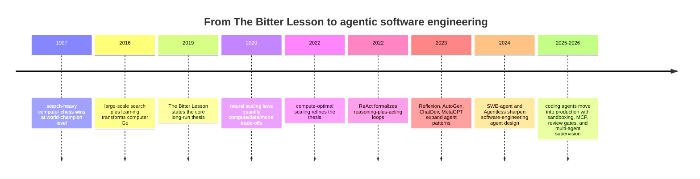
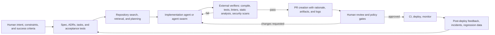

# Expanding The Bitter Lesson for Agentic Software Development

## Executive summary

Richard Sutton’s 2019 essay argues that, over the long run, AI progress comes less from hand-coding domain knowledge and more from general methods that scale with computation; in Sutton’s formulation, the enduring winners are approaches built around search and learning rather than human-crafted problem structure. In today’s software-development context, that principle maps cleanly onto agents that can search a repository, call tools, run tests, inspect failures, revise patches, and learn from large corpora of code and trajectories. The user did not specify compute or budget constraints, so this report assumes they are unconstrained unless a source explicitly discusses practical cost or latency trade-offs. citeturn35search1turn4search0turn32search0turn33view0

The most useful expansion of the Bitter Lesson for software engineering is not “replace programmers with autonomous coders.” It is “scale the entire engineering loop”: stronger base models, better post-training on real coding tasks, more inference-time search, richer tool access, more robust agent-computer interfaces, more verification, longer-horizon memory, and better orchestration. The academic and practitioner record supports this. ReAct and Reflexion show that interleaving reasoning, action, and feedback improves performance; SWE-agent shows that the design of the interface to the computer materially affects results; Anthropic’s engineering guidance repeatedly argues that simple, composable loops with strong tools and evaluations beat premature framework complexity. citeturn11view0turn11view1turn9view1turn14search0turn12search1turn12search2

At the same time, software engineering is a partial exception to naive readings of Sutton’s thesis. The best evidence does **not** say that ever-more-elaborate autonomy or ever-more-agents always wins. Agentless showed that a simple localization–repair–validation pipeline could outperform more complicated open-source software agents on SWE-bench Lite at much lower cost. Anthropic’s own production report on multi-agent research says coding tasks are often less parallelizable than research tasks. GitHub and OpenAI both retain explicit human review and approval as core safety controls for coding agents. citeturn8view0turn13search0turn17search0turn17search2turn19search0

The practical conclusion is a hybrid one. The Bitter Lesson **does** extend to software development, but the scalable object is not the raw model alone. It is the socio-technical system composed of model, tools, tests, sandbox, memory, workflow, review policy, and human judgment. The enduring human role moves upward: from typing most code to defining intent, setting boundaries, shaping reusable specifications, validating architecture, reviewing risky changes, and governing deployment. citeturn31view0turn14search0turn30search4turn17search3

## From The Bitter Lesson to agentic software development

Sutton’s original claim can be paraphrased as follows: general methods that exploit increasing computation eventually dominate narrower methods that encode human understanding of a domain, even when the narrower methods appear superior in the short term. The essay frames this as a historical pattern across AI, and explicitly identifies search and learning as the two general-purpose methods that keep scaling. citeturn35search1turn35news25

That claim has been reinforced by later empirical work on scaling. OpenAI’s scaling-laws paper reported power-law relationships between loss and model size, data size, and compute. The Chinchilla paper then argued that many large language models had been undertrained and that compute-optimal scaling requires increasing tokens alongside parameters, showing better downstream performance with a more balanced allocation of compute to model size and data. This matters for software agents because code agents are downstream systems built on top of these scaling dynamics. citeturn32search0turn33view0

In software engineering, the direct analogue of Sutton’s “search and learning” is not merely next-token generation. It is repository-scale problem solving over external environments: retrieve context, inspect files, edit code, run tests, parse logs, call APIs, invoke linters, compare outputs, and iterate until a verifier passes or a reviewer rejects the change. This is precisely the kind of environment-facing loop described by ReAct, Reflexion, and SWE-agent. citeturn11view0turn11view1turn9view1

The historical arc from expert-tuned systems toward scalable agentic engineering looks roughly like this:

This timeline synthesizes Sutton’s essay, scaling-law work, agent papers, and production engineering reports from entity["organization","Anthropic","ai safety lab"], entity["company","OpenAI","ai research company"], and entity["company","GitHub","software hosting company"]. citeturn35search1turn32search0turn33view0turn11view0turn11view1turn9view0turn8view1turn0search2turn9view1turn8view0turn1search5turn17search0turn19search1

There is one terminology wrinkle worth making explicit. In current practitioner discourse, **SDD** can mean **self-driving development** or **spec-driven development**. Those are different ideas. This report uses **self-driving development** for agent autonomy, and **spec-driven development** for a requirements-centered methodology that treats specifications as executable artifacts. The collision in terminology is real; a stable consensus name is still unspecified. citeturn30search4turn29search1

## Where the lesson holds and where it bends in software engineering

The Bitter Lesson holds strongly in software development in one central sense: systems that can **use more computation to search the space of candidate implementations and verify them externally** are generally more promising than systems that rely on brittle, hand-authored heuristics about how humans “should” write software. ReAct emphasizes interleaving reasoning and action; Reflexion adds trial-and-error with verbal self-feedback; SWE-agent shows that giving an agent a better interface to the repository materially improves performance. These are all examples of scalable meta-methods rather than domain-specific expert rules. citeturn11view0turn11view1turn9view1

But software engineering bends the lesson in at least four important ways. First, unlike chess or Atari, the objective is rarely fully specified by the environment. Tests, compilers, and CI pipelines are powerful verifiers, but they are incomplete proxies for architecture quality, security posture, maintainability, product fit, and organizational alignment. That is why GitHub, OpenAI, and Anthropic all keep human review explicitly in the loop for meaningful code changes. citeturn17search2turn17search3turn19search0turn1search0

Second, the relevant “general method” in software engineering often sits **outside** the model weights. Sutton argued against building in domain knowledge directly, but in engineering practice the winning pattern is often to externalize knowledge into artifacts that scale: tests, schemas, build scripts, checklists, structured specs, playbooks, code-review policies, and tools. GitHub’s Spec Kit is a canonical practitioner expression of this idea: the specification becomes the source of truth that agents generate, test, and validate against. citeturn30search4turn29search1

Third, software agents are unusually sensitive to harness design. Anthropic’s tool-design guidance argues that agent performance depends heavily on tool ergonomics, namespacing, concise outputs, and evaluation-driven iteration. The SWE-agent paper makes the same point more academically by framing the agent-computer interface as a first-class design choice. In other words, a pragmatic expansion of the Bitter Lesson for software is: **scale the search, but engineer the interface so the search is useful**. citeturn12search1turn14search1turn9view1

Fourth, specialization still matters, but the useful specialization is usually **learned and modular**, not hand-coded and monolithic. Cognition’s SWE-check report is a good example: a smaller RL-trained specialist for bug detection can rival a frontier generalist on its target task while being far cheaper and faster. That does not contradict Sutton; it extends him. The scalable pattern is a hierarchy in which broad generalists orchestrate or hand off to narrow, learned specialists when the interface and reward are clear. citeturn24view1

The strongest critique of simplistic “more agentic = better” reasoning comes from both academic and practitioner evidence. Agentless found that a relatively simple workflow could beat more elaborate software agents on an important benchmark while remaining more interpretable and cheaper. Anthropic’s multi-agent production report also says that coding tasks often have fewer truly parallelizable subtasks than research, so indiscriminately spawning agents can create cost and coordination overhead without proportional gain. citeturn8view0turn13search0

Human involvement therefore persists not because models cannot generate code, but because software development is a governance-bound, architecture-sensitive, socio-technical activity. The “Intelligent Development Environment” vision paper makes this explicit: the developer becomes more of a manager or curator of agentic work, and the IDE’s role shifts toward communication, orchestration, and validation. That is a direct extension of Sutton’s lesson into engineering practice. citeturn31view0

## Taxonomy of agentic approaches for self-driving development

A useful taxonomy is to classify agentic development systems by **where intelligence is concentrated**: in the model prompt, in the loop, in the workflow graph, in specialized subagents, or in structured specifications and verifiers.

| Approach family | Core idea | Representative systems or literature | Strengths | Main trade-offs |
|---|---|---|---|---|
| Prompted pair programming | Human stays in a tight conversational loop; agent mainly drafts and revises | ReAct-style prompting informs many tool-using agents; Copilot-style workflows provide interactive assistance | Fast iteration, low setup cost, high human control | Weak persistence, easy context drift, limited autonomy |
| Single-agent tool-using loop | One agent searches the repo, edits files, runs commands, and iterates | SWE-agent; Claude Code; Codex; Copilot coding agent | Strong local autonomy, simple mental model, good fit for bug fixes and scoped feature work | Can thrash without good tools, memory, or acceptance tests |
| Orchestrator–worker multi-agent | Lead agent decomposes work and delegates to subagents with separate contexts | AutoGen; Anthropic multi-agent research architecture; Codex app multi-agent supervision | Parallel breadth, context separation, good for open-ended discovery | Coordination overhead, duplicated work, coding tasks may not parallelize well |
| Role-based software-company simulation | Agents emulate PM, architect, engineer, QA, reviewer roles | ChatDev; MetaGPT | Good for pedagogy and explicit workflow structure | Can become brittle roleplay; quality depends heavily on prompt choreography |
| Agentless workflow | Use structured stages such as localization → repair → validation instead of free-form autonomy | Agentless | Interpretable, cheap, strong baselines, easier regression testing | Less exploratory, weaker open-ended search |
| Spec-driven development | Make specs, plans, and acceptance criteria first-class; agents implement against them | GitHub Spec Kit and related practitioner workflows | Reduces ambiguity, improves long-horizon coherence, valuable for brownfield and modernization work | Upfront specification effort; weak specs yield weak outputs |
| Specialist micro-agents | Use narrow learned agents for tasks like bug detection, PR review, migrations, or ML feature engineering | SWE-check; OpenHands microagents; official AI-assisted ML engineering tools | Latency and cost advantages, clearer rewards, easier product fit | Narrow coverage; composition and handoff become the hard problem |

This taxonomy synthesizes academic papers, official docs, and practitioner blogs from ReAct, Reflexion, AutoGen, ChatDev, MetaGPT, SWE-agent, Agentless, GitHub Spec Kit, OpenHands, Cognition’s SWE-check, and official coding-agent docs. citeturn11view0turn11view1turn9view0turn8view1turn0search2turn9view1turn8view0turn30search4turn29search1turn26search0turn26search10turn24view1turn36search6

A practical self-driving pipeline usually looks more like a gated engineering workflow than like an “autonomous software company” demo:

That flow is a synthesis of the software-agent loop described in SWE-agent, the practitioner guidance from Anthropic and GitHub, the spec-driven-development workflow from GitHub Spec Kit, and official coding-agent documentation from GitHub and OpenAI. citeturn9view1turn14search0turn12search0turn12search1turn30search4turn17search0turn17search2turn19search0

## Engineering patterns for integrating agents into the lifecycle

The clearest practitioner consensus is surprisingly conservative: start with simple loops, add structure only when it measurably helps, and move complexity out of chat transcripts and into reusable artifacts and tools. Anthropic’s “Building effective agents” is explicit that the strongest deployments often use simple, composable patterns rather than elaborate frameworks; the same post recommends adding complexity only when it demonstrably improves outcomes. citeturn14search0turn14search1

The best integration pattern is therefore **specify narrowly, verify aggressively, and escalate humans strategically**. For greenfield work, that means turning a product idea into a minimal spec with acceptance criteria before allowing code generation. For brownfield work, it means repository-specific instructions, architectural constraints, and localized tasks rather than “refactor the system” prompts. GitHub’s Spec Kit emphasizes this for greenfield, feature work, and modernization; Anthropic’s context-engineering and harness posts make the same point for long-running agents. citeturn30search4turn12search2turn12search0

Tooling matters as much as prompting. Anthropic’s tool-writing guidance recommends selective tools with clear names, concise outputs, realistic evaluation tasks, and strict schemas; SWE-agent likewise treats the agent-computer interface as a key determinant of performance. In practice, agents perform better when tools reduce context burden rather than merely exposing raw APIs. citeturn12search1turn9view1

Durability and memory are essential for long-horizon work. Anthropic’s harness guidance proposes initializer agents, coding agents that leave explicit artifacts for later sessions, and external memory to bridge context windows. GitHub’s spec-driven practice and Cognition’s playbooks and DeepWiki are practitioner variants of the same pattern: do not trust long-horizon coherence to the model alone. Persist the plan, the conventions, and the rationale in machine-readable artifacts. citeturn12search0turn30search4turn23view0

Parallelism should be earned, not assumed. Anthropic reports strong internal gains from multi-agent parallelism on breadth-first research, but the same report warns that coding tasks are often less parallelizable. The practical rule is to parallelize only where subtasks have weak coupling: issue triage across independent tickets, PR review, documentation generation, test expansion, dependency remediation, or codebase search. Keep tightly coupled design and refactor loops closer to a single agent plus human supervisor. citeturn13search0

Security and governance need to be designed in, not bolted on. GitHub’s coding-agent docs emphasize ephemeral environments, restricted workflow execution until approval, and mandatory human review. Anthropic’s sandboxing post describes filesystem and network isolation that reduced permission prompts internally while increasing safety. OpenAI’s Codex launch similarly centers sandboxes, logs, test results, and mandatory user review. citeturn17search3turn17search2turn1search5turn19search0

A lifecycle matrix makes the hybrid pattern concrete:

| Lifecycle stage | Human role | Agent role | Recommended hard gate |
|---|---|---|---|
| Problem framing | Define intent, risk, and acceptance criteria | Draft spec, decompose work, retrieve context | Spec and acceptance criteria approved by a human |
| Design | Choose architecture boundaries, reject unsafe shortcuts | Propose options, generate ADR drafts, map dependencies | Architecture review for high-impact changes |
| Implementation | Supervise scope and iterate on requirements | Edit code, run commands, generate tests, update docs | Clean compile plus test suite plus static analysis |
| Review | Judge maintainability, product fit, and policy compliance | Summarize diffs, answer codebase questions, autofix comments | Human PR approval required before merge |
| Deployment | Decide production exposure and rollback policy | Prepare artifacts, analyze CI failures, suggest fixes | Protected-branch and deploy-policy checks |
| Operations | Prioritize incidents and adjudicate risk | Triage bugs, inspect logs, suggest patches, prepare regression tests | Human sign-off for destructive or user-impacting actions |

This pattern is consistent with GitHub’s coding-agent documentation, OpenAI’s Codex design, Anthropic’s agent-safety and tool-design guidance, and Cognition’s internal playbook-based use of Devin. citeturn17search0turn17search2turn19search0turn12search1turn1search5turn23view0

## Evidence from benchmarks and practitioner deployments

Benchmarking in this space is improving, but measurement remains fragile. SWE-bench evaluates whether systems can resolve real GitHub issues in Dockerized repos. OpenAI then introduced SWE-bench Verified as a human-validated subset, but later argued that SWE-bench Verified had become contaminated for frontier systems and recommended a newer benchmark, SWE-bench Pro. OpenAI’s SWE-Lancer moves further toward labor-market realism by combining over 1,400 freelance engineering and managerial tasks valued at about $1 million, and it reports that frontier models still fail to solve the majority of tasks. Terminal-Bench broadens the scope beyond issue resolution to terminal tasks, while Anthropic shows that infrastructure configuration alone can swing agentic evaluation scores by several percentage points, sometimes more than leaderboard gaps. citeturn6search3turn2search2turn2search5turn25search0turn25search3turn25search6turn27search0

These benchmark results imply two things that matter for any expansion of the Bitter Lesson. First, more compute and more capable agents continue to raise performance. Second, software-agent benchmarking is no longer “just” a model benchmark; it is an end-to-end systems benchmark over sandboxing, resource limits, tool quality, evaluator contamination, and orchestration. That is exactly why the Bitter Lesson must be expanded from “scale the model” to “scale the verified engineering loop.” citeturn27search0turn25search0turn2search5

Representative practitioner and open-source evidence looks like this. Where a report omits denominators, baselines, or defect-escape data, those fields are marked **unspecified** rather than inferred.

| Evidence type | System or organization | Reported outcome | Main lesson |
|---|---|---|---|
| Controlled academic field experiment | GitHub Copilot / entity["organization","Microsoft Research","computer science lab"] | Developers with Copilot completed a JavaScript HTTP-server task 55.8% faster; GitHub later reported higher functional, readable, reliable, maintainable, and concise code in a randomized controlled trial | Pair-programming assistance already produces measurable gains, but this is still a hybrid human–AI workflow, not full autonomy citeturn16search1turn16search4turn16search0 |
| Open-source benchmark system | SWE-agent | Achieved state-of-the-art results at publication time and explicitly attributes gains to a custom agent-computer interface | Interface quality is a scaling lever, not UI polish citeturn9view1 |
| Open-source critique baseline | Agentless | On SWE-bench Lite, a localization–repair–validation workflow reached 32.0% with low cost | Simpler, interpretable pipelines can beat more elaborate agents citeturn8view0 |
| Production coding agent | Anthropic / entity["company","Rakuten","japanese technology group"] | Rakuten reports 7 hours of sustained autonomous coding on a complex task, 99.9% accuracy on a specific code-modification exercise, and a reduction in average feature delivery time from 24 working days to 5 | Long-running autonomy becomes useful when verification is strong and the workflow is redesigned around the agent citeturn18search1 |
| Production coding agent | entity["organization","Anthropic","ai safety lab"] / entity["company","Ramp","financial operations platform"] | Ramp reports over 1 million lines of AI-suggested code in 30 days and up to 80% reduction in incident-investigation time | The highest near-term leverage is often in triage, glue work, and incident response, not just feature coding citeturn18search0 |
| Production code-review agent | entity["organization","Anthropic","ai safety lab"] / entity["company","Graphite","developer tools company"] | Graphite reports 40x faster PR feedback, 96% positive feedback on comments, and 67% implementation rate of suggestions | As code generation accelerates, review becomes the new bottleneck, creating room for specialist agents citeturn18search2 |
| Internal agent-first engineering | entity["company","Cognition","ai software company"] | Cognition reports merging 659 Devin PRs in a week, up from 154 in its best week in 2025; it also emphasizes playbooks, review tooling, and breaking large tasks into isolated sessions | Scaled adoption depends on process artifacts and review ergonomics, not only model capability citeturn23view0 |
| Boundary-case modernization | Cognition on COBOL | Vendor report says agents help document and modernize some legacy systems, but also states that transactional COBOL migration remains out of reach because the agent cannot easily restore the execution feedback loop | The Bitter Lesson does not eliminate environmental bottlenecks; without verifiable loops, autonomy stalls citeturn24view0 |

Open-source multi-agent systems like ChatDev and MetaGPT are best interpreted as research prototypes demonstrating explicit coordination patterns rather than as settled evidence that role-based “AI software companies” are the dominant production architecture. Their real contribution is to widen the design space for orchestration. citeturn8view1turn0search2

## Open research questions and recommended experiments

The most important unanswered question is **what should scale** in software engineering: model size, token budget, tool count, reasoning depth, number of agents, quality of specifications, or quality of verifiers. Current literature suggests all of these matter, but not equally, and not on every task. Anthropic’s multi-agent report, Agentless, and infrastructure-noise analysis all imply that benchmark progress can come from very different sources. citeturn13search0turn8view0turn27search0

A strong research program would therefore run the following experiments.

1. **Resource-normalized architecture ablations.** Compare single-agent, orchestrator–worker, role-based multi-agent, and agentless pipelines under the same model, repo context, sandbox, wall-clock budget, token budget, and resource limits. Report not only task success but defect escape, reviewer effort, and rerun variance. This directly addresses the infrastructure confounds Anthropic documented. citeturn27search0turn13search1

2. **Specification-memory ablations.** Run the same brownfield tasks with and without spec artifacts, ADRs, task files, repository instructions, and persistent memory. Measure architectural consistency, regression rate, and human re-explanation burden. GitHub’s Spec Kit and Anthropic’s harness/context work make this empirically testable. citeturn30search4turn12search0turn12search2

3. **Human-review allocation studies.** Randomize whether humans review only final diffs, or also plans, specs, or intermediate steps. Measure merge success, review time, rollback rate, and post-merge bug rate. This would identify where human attention has the highest leverage in hybrid workflows. citeturn17search2turn19search0turn31view0

4. **Agent-computer-interface experiments.** Vary tool schemas, namespacing, response truncation, file-edit formats, and error messages while holding the model constant. Anthropic and SWE-agent both imply that ACI quality is a major independent variable, but the field still lacks standardized public ablations. citeturn12search1turn9view1

5. **Specialist-versus-generalist mixtures.** Evaluate whether narrow learned agents for bug detection, review, testing, incident triage, and feature engineering improve end-to-end outcomes when placed inside a broader generalist loop. Cognition’s SWE-check suggests there is real leverage here; the open question is how much of the workflow should specialize. citeturn24view1

6. **Benchmark-to-production transfer.** Track the correlation between benchmark scores on SWE-bench, SWE-Lancer, and Terminal-Bench and real-world engineering metrics such as time-to-merge, review burden, escaped defects, customer-facing incidents, and mean time to recovery. OpenAI’s contamination warning and Anthropic’s infrastructure warning make this urgently necessary. citeturn2search5turn25search0turn27search0

7. **Autonomous ML-pipeline studies.** The literature and official practitioner evidence are thinner here than for code repair and PR automation. A promising experiment would test whether agents can reliably generate, validate, and maintain feature pipelines or retraining workflows under explicit data-quality checks, schema contracts, and rollback policies. Public evidence surveyed here suggests this area is emerging, but performance baselines and generality are still largely unspecified. citeturn36search6

The right evaluation metrics for these experiments should go beyond pass@1. A serious software-agent scorecard should include patch success, review burden, defect escape, rollback rate, verification cost, latency, variance across reruns, and human trust or override rate. Anthropic’s eval guidance makes exactly this broader point: agent evaluation has to match the complexity of the deployed system. citeturn14search4turn13search1

## Governance, safety, and human involvement

The deepest governance lesson from current deployments is that agentic software development expands the attack surface at the same time that it expands productivity. GitHub’s coding-agent docs explicitly warn that pull requests created by Copilot must be reviewed thoroughly, that approvals still matter for protected branches, and that hidden-text prompt injection is a real risk. Anthropic’s sandboxing work highlights prompt injection and introduces filesystem and network isolation to contain agent actions. OpenAI’s Codex launch similarly emphasizes sandboxes, transparency through terminal logs and test results, and manual review before integration. citeturn17search2turn17search3turn1search5turn19search0

This pushes the enduring human role into three areas that agents do not remove. The first is **intent and legitimacy**: humans decide what should be built, what data and systems an agent may access, and what kinds of changes are acceptable. The second is **risk acceptance**: humans decide when a possibly correct patch is too invasive, too opaque, too security-sensitive, or too misaligned with long-term architecture. The third is **accountability**: organizations still need a traceable chain of responsibility for merges, deployments, incidents, and user impact. citeturn31view0turn17search2turn19search0

Technically, the most defensible governance stack today includes least-privilege tool access, explicit permission modes, sandboxed execution, branch protections, approval gates, audit logs, persistent artifacts, and bounded internet access. MCP is helpful here not only because it expands capability, but because it provides a standard protocol for exposing tools, prompts, and resources in a structured way that can itself be governed, logged, and versioned. citeturn15search0turn17search4turn1search5

Ethically, the main near-term issues are not science-fiction loss of control but more ordinary organizational harms: over-trusting vendor metrics, deploying agents without evaluation rigor, leaking sensitive code or secrets, eroding junior-engineer learning if humans are reduced to passive approvers, and obscuring responsibility when an agent-authored change causes harm. The practitioner literature implicitly recognizes this: GitHub, OpenAI, and Anthropic all preserve review steps, and the “Intelligent Development Environment” vision reframes the developer as an active orchestrator rather than a redundant observer. citeturn17search2turn19search0turn31view0

The sharpest expansion of the Bitter Lesson for software development is therefore this: **do not confuse scalable autonomy with scalable engineering**. What scales in successful deployments is not merely model size or number of agents. It is the disciplined combination of general models, external verifiers, structured specifications, durable memory, safe tools, robust harnesses, and accountable human supervision. In software engineering, the long-run winner is likely to be the team that treats human judgment as the scarce control layer and lets agents absorb the search, synthesis, and execution beneath it. citeturn35search1turn14search0turn30search4turn17search2turn1search5turn19search1