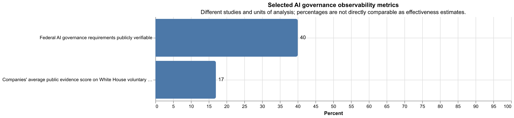

# AI Governance in 2026: Frameworks, Regulation, Practice, and Gaps

## Executive Summary

AI governance is not one thing. Across the literature and official guidance, it is best understood as a layered system of controls spanning technical assurance, organizational process, legal regulation, standards, public oversight, and international norms. The strongest cross-source consensus is that governance must be **multi-level**, **sociotechnical**, and **lifecycle-wide**: it cannot be reduced to model evaluations alone, nor to board policy alone, nor to state regulation alone.

A second strong finding is that the field has moved from **principles-first ethics** toward **operational governance**. Earlier work emphasized high-level norms such as fairness, transparency, accountability, safety, and human rights. More recent frameworks emphasize risk management, impact assessment, documentation, deployment gating, monitoring, and defined governance roles. In parallel, current practice has bifurcated: frontier labs increasingly publish threshold-based preparedness or scaling policies, while major cloud/platform deployers publish runtime safety controls, monitoring, and customer-facing governance tooling.

The weakest part of the field is not the absence of frameworks but the gap between frameworks and reliable accountability. The evidence reviewed here is much stronger on **failure modes** than on proven successes. Available empirical work suggests weak implementation of governance mandates, uneven transparency compliance, immature audit regimes, incomplete incident reporting, and poor observability of whether voluntary commitments were actually carried out. The practical implication is that AI governance in 2026 is real and increasingly institutionalized, but still only partially enforceable and only partially measurable.

## 1. What AI Governance Covers

Across the literature, AI governance is broader than regulation. It includes:

- **Technical governance**: evaluations, red-teaming, monitoring, access controls, safety cases, interpretability, logging, and incident handling.
- **Organizational governance**: documented policies, approval gates, board or officer oversight, risk ownership, model/system documentation, procurement controls, and audit processes.
- **Public governance**: legislation, regulatory supervision, agency guidance, public-sector procurement requirements, treaty regimes, and liability or enforcement structures.
- **International and standards governance**: intergovernmental principles, due-diligence guidance, management-system standards, impact-assessment standards, and cross-border reporting norms.

The literature reviewed in T1 converges on three core descriptive points. First, governance is **multi-level**: team, firm, sector, state, and international layers all matter. Second, governance is **lifecycle-wide**: controls before training or deployment are not enough; post-deployment monitoring, remediation, and decommissioning also matter. Third, governance is **sociotechnical**: many risks are not reducible to model behavior alone because they depend on deployment context, incentives, institutional capacity, and who bears downstream harms.

## 2. Major Schools of Thought and Framework Families

### 2.1 Principles-based and rights-based governance

The earlier and still influential family of AI governance is principles-based. This literature maps recurring commitments such as transparency, fairness, non-maleficence, privacy, safety, accountability, and human oversight. UNESCO and related rights-based frameworks broaden this into dignity, non-discrimination, democratic values, and social justice. Observation: these sources are strong at articulating normative direction. Inference: they work best as constitutional or orienting layers, not as self-sufficient operating systems for governance.

### 2.2 Risk-based governance

A second family centers on structured risk management. NIST’s AI RMF and OECD accountability work are representative: they organize governance around identifying, measuring, managing, and tracking risks across the AI lifecycle. This family has become especially influential in enterprise and public-administration settings because it is easier to connect to compliance functions, management systems, assurance processes, and procurement.

### 2.3 Lifecycle and organizational governance

A third family translates principles into process. Examples include organizational governance models, AI engineering pattern catalogues, and sector-specific governance models such as those proposed for healthcare AI. These approaches emphasize governance roles, decision rights, documentation, pre-deployment review, monitoring, and escalation pathways. Their strength is operational clarity; their weakness is that they can understate politics, power, and enforceability.

### 2.4 Frontier or advanced AI governance

A newer family focuses specifically on highly capable or frontier systems. This literature treats certain governance questions as distinct from generic responsible-AI concerns: dangerous capability evaluations, preparedness frameworks, capability thresholds, model access restrictions, and governance for systemic-risk models. This track overlaps with technical AI governance, which asks what technical tools are needed to make governance actually work.

### 2.5 Corporate-governance and institutional-design approaches

A smaller but increasingly important strand treats the governance of AI firms themselves as part of the subject. The underlying claim is that board structure, control rights, public-benefit commitments, and incentive design shape what kinds of governance measures are credible. Observation: this subfield is growing. Uncertainty: compared with risk-management and ethics frameworks, the evidence base here is still thinner and more conceptually uneven.

## 3. The Current Governance Landscape in 2025–2026

### 3.1 Binding regulation

The strongest current binding regime in the source set is the **EU AI Act**. It establishes a risk-based structure with prohibited uses, obligations for high-risk systems, transparency requirements for certain AI-generated content, and governance duties for providers of general-purpose AI models, including additional obligations for some models with systemic risk. The official implementation schedule is phased: the Act entered into force in August 2024, prohibited-practice rules and general provisions began applying in February 2025, GPAI-related rules began applying in August 2025, and much of the remaining high-risk-system regime applies in 2026, with some later milestones still unfolding.

The practical governance consequence is that firms interacting with the EU market increasingly need role-specific controls for provider, deployer, importer, distributor, or GPAI-provider obligations. This is not just an ethics overlay; it is becoming a structured operational-compliance regime.

A second binding development is the **Council of Europe AI Framework Convention**, but its practical force remains status-dependent. The reviewed sources support describing it as the first international legally binding treaty framework for AI governance around human rights, democracy, and rule of law. However, claims about its in-force effect must be phrased carefully because legal force depends on signature, ratification, and entry-into-force conditions, which remain jurisdiction-specific.

### 3.2 Government governance guidance and internal public-sector rules

In the United States, the most governance-relevant current sources in this review are not economy-wide AI statutes but official federal governance and procurement memos. The 2025 OMB memoranda require covered agencies to designate governance leadership, inventory AI use cases, publish strategy or compliance materials, set internal governance processes, and apply specific safeguards to high-impact AI use cases. This is narrower than economy-wide regulation, but it is still consequential because it shapes agency operations, procurement, testing, documentation, and oversight.

The UK remains comparatively non-statute-centric in the reviewed sources, favoring a sectoral, regulator-led approach organized around cross-cutting principles such as safety, transparency, fairness, accountability, and redress.

### 3.3 Soft law and standards

Three soft-law / standards clusters matter most in the evidence gathered:

1. **OECD principles and due-diligence guidance**: influential as interoperability and policy-convergence instruments rather than direct law.
2. **NIST AI RMF plus the Generative AI Profile**: highly influential for organizational governance design, especially in the U.S. and among firms seeking a practical control framework.
3. **ISO/IEC governance standards**: especially ISO/IEC 42001 on AI management systems, ISO/IEC 23894 on AI risk management, and ISO/IEC 42005 on AI impact assessment.

Taken together, these instruments are shaping a recognizable governance stack: principle layer, risk-management layer, management-system layer, and application-specific assurance layer.

## 4. What Organizations Actually Do in Practice

The practice track in T3 suggests an important split between **frontier-lab governance** and **deployer/platform governance**.

### 4.1 Frontier-lab governance

The clearest public examples in the source set are Anthropic, OpenAI, and Google DeepMind.

- **Anthropic** publicly documents a Responsible Scaling Policy with AI Safety Level thresholds, escalating safeguards, named governance roles, board-related approval paths, external review triggers, recurring risk-report commitments, and annual procedural review commitments.
- **OpenAI** publicly documents a Preparedness Framework with tracked risk categories, thresholds for stronger safeguards, governance escalation to internal groups and board committees, and specific statements about halting or withholding deployment if safeguards are inadequate.
- **Google DeepMind** publicly documents a Frontier Safety Framework organized around critical capability levels, safety-case logic, evaluation triggers, deployment mitigations, and governance-body approval before some releases.

These documents are notable because they go beyond generic ethical principles. They specify when stronger controls should be triggered and tie those triggers to release governance.

### 4.2 Public evidence of operational controls

The best public evidence of actual operation in this source set comes from **system cards, model cards, and platform transparency notes**, not just top-level framework documents.

- Anthropic’s Claude 4 system card documents pre-deployment testing and an explicit safety-level release determination.
- OpenAI’s Operator system card documents concrete controls such as red-teaming, high-risk task refusals, prompt-injection monitoring, restricted deployment conditions, and post-deployment review.
- Google DeepMind’s Gemini 3.1 Pro model card documents frontier-safety evaluations across multiple domains and describes whether the model crossed internal alert thresholds.

Observation: these artifacts are more informative than mission statements because they contain release-specific evidence. Limitation: they remain vendor-authored documents, not independent audits.

### 4.3 Deployer and platform governance

Microsoft and AWS illustrate a different governance pattern. Their public documents emphasize runtime and platform controls rather than frontier-model development governance:

- abuse detection
- configurable guardrails
- content filtering
- logging and monitoring guidance
- adversarial evaluation tooling
- human-in-the-loop recommendations
- supply-chain and procurement-style governance features

Inference: as AI deployment becomes more distributed, governance increasingly lives not only at model-creation time but also in serving infrastructure, account policy, and application-layer monitoring.

## 5. What the Strongest Evidence Says About Gaps and Failure Modes

This is the most sobering part of the evidence base.

### 5.1 Governance implementation is often weak even when requirements exist

One of the strongest empirical findings in the source set is from a study of U.S. federal agency implementation of binding AI-governance requirements. It found that fewer than 40% of identified legal requirements could be publicly verified as implemented, and that many agencies failed to publish required or expected inventories and plans. This does not prove noncompliance in every specific case, because public observability is not identical to true implementation. But it is strong evidence that governance systems often lack visible proof of execution.

### 5.2 Audit regimes remain immature

The evidence on auditing is mixed. Governance discourse often treats audits as central accountability tools, but both general reviews and a detailed case study of New York City’s algorithmic bias audit regime suggest serious limitations:

- key legal terms may be underspecified
- auditor independence may be ambiguous
- access to vendor or employer data may be constrained
- transparency reports may not force remediation
- audits can drift into box-checking or symbolic assurance

This does not mean audits are useless. It does mean the evidence base is not yet strong enough to treat “audited” as a robust indicator of trustworthy outcomes without knowing the audit design.

### 5.3 Voluntary governance is observable only weakly

The critique of voluntary commitments is not merely philosophical. The evidence assembled in T4 suggests a recurring pattern: public commitments are easier to publish than to verify. One 2025 study of company implementation evidence for White House voluntary AI commitments found low public-evidence scores overall. Taken cautiously, this is not proof that firms did nothing; it is evidence that outsiders often cannot tell what was actually done.

### 5.4 Transparency helps, but transparency alone is not accountability

This is one of the clearest cross-source conclusions. Transparency supports scrutiny, research, and possibly market or legal pressure. But disclosure without data access, enforcement powers, remediation duties, or public-sector capacity often fails to produce meaningful accountability. The New York City audit case and the NTIA accountability report both reinforce this point from different angles.

### 5.5 Pre-deployment governance is necessary but not sufficient

The frontier-lab frameworks reviewed in T3 are largely pre-deployment or release-gating oriented, with some post-deployment monitoring components. But incident-reporting and harm-analysis work in T4 indicates that important harms emerge only after deployment and often affect people who never directly chose to use the system. This matters because governance systems centered only on model developers and direct users can miss third-party and societal harms.

### 5.6 Capability or compute thresholds are useful but contested proxies

Threshold-based governance is increasingly common in frontier-lab practice and some policy design. The critique is that thresholds based on capability proxies or compute may be easier to administer than direct risk measures but can become misaligned with the actual harms of deployed systems. The current evidence here is mainly analytical and modeling-based rather than empirical. The cautious conclusion is that threshold-based governance is an important operational tool, but not yet a settled solution to the problem of governing the most dangerous systems.

## 6. Areas of Real Convergence

Despite the disagreements, several conclusions appear robust across literature, policy, and practice.

### 6.1 Governance must be lifecycle-wide

This is one of the strongest consensus findings. Sources from UNESCO, OECD, NIST, and organizational governance models all treat governance as beginning before deployment and extending through monitoring, incident response, and eventual retirement.

### 6.2 Governance requires both technical and institutional controls

Evaluations, red-teaming, monitoring, and access controls matter. But so do governance roles, approval gates, procurement terms, documentation standards, reporting obligations, and public oversight. No strong source in this review argues that technical controls alone are sufficient.

### 6.3 Documentation and traceability are becoming normal governance artifacts

Model cards, system cards, technical documentation, impact assessments, inventories, and transparency notes now recur across both public and private governance materials. This does not guarantee accountability, but it does indicate institutionalization of governance practices that were far less standardized a few years ago.

### 6.4 The center of gravity is moving from ethics principles to operational governance

This does not mean principles became irrelevant. It means they increasingly function as the top layer of a larger governance stack whose lower layers include risk frameworks, management systems, impact assessment, deployment controls, and supervision.

## 7. Disagreements and Unresolved Questions

### 7.1 Voluntary versus mandatory governance

A major unresolved question is how much can be left to firms. Frontier labs now publish more concrete governance frameworks than before, but the best evidence on accountability gaps suggests voluntary commitments without independent verification remain weak.

### 7.2 Model-level versus application-level governance

Some harms are model-intrinsic and justify model-level controls. Others are overwhelmingly deployment-specific and may be better governed at the application, platform, or sector layer. The evidence supports needing both, but the correct balance remains unsettled.

### 7.3 Frontier-risk governance versus present-harm governance

A live dispute remains over how much governance attention should go to catastrophic or systemic future capabilities versus currently deployed harms such as fraud, bias, privacy invasion, labor impacts, and manipulation. The review suggests both are governance subjects, but the empirical evidence base is currently stronger for existing harms than for catastrophic-threshold governance.

### 7.4 Auditability and external access

Who gets access to models, logs, incident data, and evaluation environments is still unresolved. Without access, external accountability remains weak. With broad access, firms raise security, privacy, and IP objections. The field has not yet settled a stable answer.

### 7.5 Measuring governance effectiveness

The biggest evidence gap is causal: which governance mechanisms actually reduce harm, under what conditions, and at what cost? We have growing evidence that some governance instruments are underspecified or weakly implemented. We have much less rigorous comparative evidence showing which combinations work best.

## 8. Practical Takeaways for Designing or Assessing an AI Governance Program

For a decision-maker in 2026, the evidence supports the following pragmatic stance.

1. **Treat AI governance as a stack, not a single policy.** Principles, risk management, management systems, release governance, monitoring, and incident response all matter.
2. **Separate authoritative requirements from voluntary controls.** Legal obligations, standards, and internal commitments should not be mixed together in one undifferentiated checklist.
3. **Require evidence of execution, not just policies.** If a control matters, ask for logs, reports, thresholds, review records, test artifacts, or incident procedures.
4. **Build post-deployment governance early.** Pre-release evaluation is necessary but insufficient.
5. **Be cautious with “audited” and “responsible” labels.** Their value depends on scope, independence, access, remediation, and enforcement.
6. **Track third-party harms explicitly.** Governance that focuses only on the developer-user dyad misses many real harms.
7. **Use thresholds as triggers, not as the whole theory of governance.** Thresholds can help operationalize escalation, but they are not a substitute for broader risk and accountability design.

## 9. Quantitative Snapshot

**Figure 1. Selected AI governance observability metrics from two different studies.** One study found that **fewer than 40%** of identified U.S. federal AI-governance requirements could be publicly verified as implemented; another found an average **17%** public-evidence score for company implementation of major White House voluntary AI commitments. These values come from different studies and are **not directly comparable as outcome measures**, but together they illustrate a recurring observability problem: governance promises are often easier to state than to verify. Underlying chart artifact: `outputs/ai-governance-observability.png`.

## Open Questions

1. Which governance mechanisms measurably reduce incidents or downstream harms across sectors?
2. How should regulators and firms structure confidential access for auditors, researchers, and regulators without undermining security or privacy?
3. What governance regime is appropriate for open-weight and open-source frontier-capable models?
4. How should post-deployment incident reporting be standardized across firms and jurisdictions?
5. How should governance balance present-harm mitigation against frontier-risk preparedness?
6. When should management-system standards and impact-assessment standards be treated as sufficient evidence of control, and when are they only partial evidence?

## Claim Sweep Notes

- Claims about the broad definition and scope of AI governance are grounded in the literature synthesis and official frameworks reviewed in `outputs/ai-governance-research-literature.md`.
- Claims about current regulation and standards are grounded in official sources reviewed in `outputs/ai-governance-research-regulation.md`.
- Claims about frontier-lab and platform governance practices are grounded in public policy/framework/system-card/model-card/vendor-doc sources reviewed in `outputs/ai-governance-research-practice.md`.
- Claims about implementation gaps, audit limits, voluntary-commitment observability, incidents, and threshold critiques are grounded in the studies and official reports reviewed in `outputs/ai-governance-research-gaps.md`.
- No calculations were performed beyond reproducing two percentages from source materials into Figure 1. The chart is a presentation artifact of already-reported values, not an original statistical analysis.
- Remaining uncertainty: current treaty-ratification status and some implementation timelines are evolving; corresponding statements in the brief are phrased conservatively.
